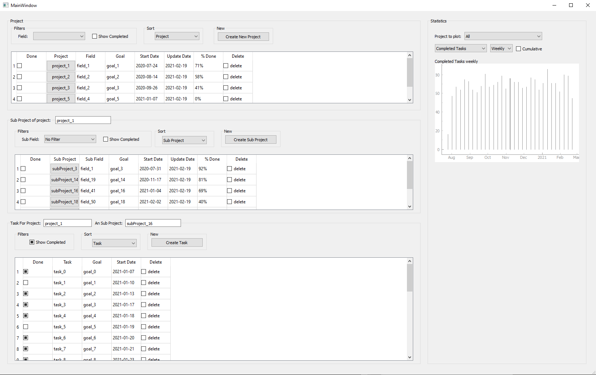

# todolist_software

This app consist on a todo list, built with pyqt5. \
You cann create and edit project, then subdivide them in sub-projects that will then contain your tasks. \
You can view anlytics of productivity on the right side of the gui with task created, task completed, sub-projects created and completed, cumulative or not and with filters on the desired project. \
More analytics will be added later, but the data recording will not change. (meaning the task created between versions cannot be corrupted)

GUI interface


# simultaion of tasks

A simulation script have bee created within `taskSimulator.py` \
You can instance a simulator with the average daily data (project created, task completed ect). See bellow: \

```python
from taskSimulator import TaskSimulator
import time
simulator = TaskSimulator(init_time=time.time()-60*60*24*210, 
                          end_time=time.time(),
                          daily_new_project = 0.025,
                          daily_new_subproject = 0.3,
                          daily_new_task = 15,
                          daily_complete_task = 10,
                          daily_complete_subproject = 0.15,
                          daily_complete_project = 0.012,
                          proba_new_field = 0.3,
                          proba_new_subField = 0.2,
                          do_reset = True)

```
Here for example, within 20 days you have created 6 subrojects, completed 3. \
This is assuming that all variables of creation and completion are independant. \
Then each hour of the day we will simultate a bernouilli variable of probability mu^j/24. 
It represents the occuring of the event j within a one hour timeframe. \
Then let X_i^j be the variable representing the number of event j during day i. \
It follows a binomial law: 


with muj the desired average event j within a day.

You can then run the simulation with 
```python
simulator.run()

```


# Requierment

 * pyQt5
 * pynstaller
 * numpy / pandas

# deploy

- [ ] edit the config file
- [ ] in terminal run `pyinstaller.exe --onefile --windowed --icon=icon.ico main.py`

  
  
# Todo List

- [ ] Finish data analytics / stats
  - [ ] add graph of task_created/task_completed
  - [ ] add bar graph of most active project/sub project of last 7 days/1month (by task completed)
  - [ ] link edit goal signal to edit json
  
# References

* pyQt5 doc: https://doc.qt.io/qtforpython-5/PySide2/QtWidgets/index.html#module-PySide2.QtWidgets

* pyinstaller: https://www.pyinstaller.org/

* deploy help: https://www.youtube.com/watch?v=Em9JNEI6Zfc
